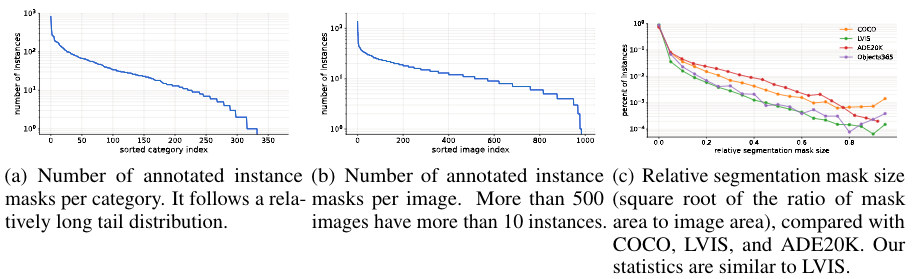

# DaTaSeg Objects365 Instance Segmentation Dataset

Here we release the DaTaSeg Objects365 Instance Segmentation Dataset introduced in the [DaTaSeg paper](https://arxiv.org/abs/2306.01736), which can be used as an evaluation benchmark for weakly or semi supervised segmentation.

We randomly sample 1,000 images from the [Objects365](https://www.objects365.org/overview.html) v2 evaluation set. We then annotate the instance masks for the groundtruth bounding boxes in the sampled images.

Specifically, for each bounding box annotation, we generate a foreground/backgroundannotation question for the raters. In the question, raters are asked to paint a semi-transparent instancemask on the original image, with the groundtruth bbox shown on the image as a guide and thegroundtruth category displayed on the side. We do not crop the original image to the bbox region, but show the entire image to provide more context information, which is especially helpful for smallobjects. If the boundary is too blurry or too dark to annotate the instance mask, the raters can skip thequestion.

For more details, please refer to our [paper](https://arxiv.org/abs/2306.01736).


## Downloads
Our annotations are released in [o365_instance_seg_val.json](./o365_instance_seg_val.json) in this Github repo.
For the images, please download at the [Objects365 official website](https://www.objects365.org/download.html).


## Data format
Our annotations follows the [COCO annotation format](https://cocodataset.org/#format-data). We added a `segmentation` field to each of the original detection annotations.


## Visualization

We release a [jupyter notebook](./Visualize_o365_instance_seg.ipynb) for you to visualize our datasets.

The figure below shows some visualization of our dataset.


## Dataset statistics
We inserted a total of 13,372 questions. Following the common practice in instance segmentation, we did not label the crowd instances, as they are skipped in both training and inference. In the end, we obtained 12,836 valid instance mask annotations.
It took a total of 800.59 rater hours. On average, raters spent 3.74 minutes on each valid mask. 

We show some dataset statistics in the figure below.



## Citation

If you find this dataset useful in your research, please consider cite our paper.

```
@article{gu2023dataseg,
  title={DaTaSeg: Taming a Universal Multi-Dataset Multi-Task Segmentation Model},
  author={Gu, Xiuye and Cui, Yin and Huang, Jonathan and Rashwan, Abdullah and Yang, Xuan and Zhou, Xingyi and Ghiasi, Golnaz and Kuo, Weicheng and Chen, Huizhong and Chen, Liang-Chieh and others},
  journal={Advances in Neural Information Processing Systems},
  year={2023}
}

```

## Contact us

If you have a technical question regarding the dataset, code or publication, please create an issue in this repository or email xiuyegu@google.com. 

If you would like to share feedback or report concerns, please email us at xiuyegu@google.com.